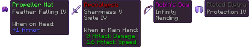

#  **Mob Captains**

**Rare Mob Captains will spawn in your world, dropping illegally enchanted loot!**

## **Overview**

Mob Captains of **common, uncommon, rare and legendary difficulty** will spawn in your world.

The Mob Captains are <b>buffed based on their rarity</b>!

<b>Common</b> 
+50% Max Health 
+2 Armor 
+15% Movement Speed 
+70% Attack Damage 
+3% Knockback Resistance 
<b>Uncommon</b> 
+90% Max Health 
+4 Armor 
+25% Movement Speed 
+120% Attack Damage 
+10% Knockback Resistance 
<b>Rare</b> 
+180% Max Health 
+8 Armor 
+40% Movement Speed 
+210% Attack Damage 
+50% Knockback Resistance 
<b>Legendary</b> 
+270% Max Health 
+15 Armor 
+80% Movement Speed 
+300% Attack Damage 
+100% Knockback Resistance 

These Mob Captains will **drop items that are enchanted** in a way that is **not possible in the vanilla game**.

You can **easily configure** the data pack to your liking.

This data pack is inspired by **Atomic Stryker's** legendary [**Infernal Mobs**](https://www.curseforge.com/minecraft/mc-mods/atomicstrykers-infernal-mobs) mod.

## **Configure the Pack**
Many aspects of this data pack can be configured by simply changing some score values.

You can access a **chat based configuration menu** while **ingame** by running the command `/function ps-mob:config` if you have operator permissions.

Set the scoreboard values of the <code>ps-mob.config</code> scoreboard to your desired values!

<table>
  <tr>
    <th>Name</th>
    <th>Default</th>
    <th>Description</th>
  </tr>
  <tr>
    <td><code>.cool_down</code></td>
    <td><code>60</code></td>
    <td>The time, in seconds, to stop trying to spawn a captain after successfully spawning one</td>
  </tr>
  <tr>
    <td><code>.spawn_chance</code></td>
    <td><code>10</code></td>
    <td>The maximum chance, that a mob becomes a Mob Captain, with 1 being 0.1% and 1000 being 100%</td>
  </tr>
  <tr>
    <td><code>.notify_on_spawn</code></td>
    <td><code>2</code></td>
    <td>What rarity of Mob Captain is announced to chat and with a sound, with 0 being for none, 1 only for legendaries and 4 being for all rarities of Mob Captain</td>
  </tr>
  <tr>
    <td><code>.beam_on_spawn</code></td>
    <td><code>1</code></td>
    <td>If Mob Captains should create a particle beam when spawning that shows their location for about 1 second, with 1 being turned on and 0 it being turned off</td>
  </tr>
  <tr>
    <td><code>.weight_common</code></td>
    <td><code>55</code></td>
    <td>Weight for a Mob Captain being of common rarity</td>
  </tr>
  <tr>
    <td><code>.weight_uncommon</code></td>
    <td><code>30</code></td>
    <td>Weight for a Mob Captain being of uncommon rarity</td>
  </tr>
  <tr>
    <td><code>.weight_rare</code></td>
    <td><code>9</code></td>
    <td>Weight for a Mob Captain being of rare rarity</td>
  </tr>
  <tr>
    <td><code>.weight_legendary</code></td>
    <td><code>1</code></td>
    <td>Weight for a Mob Captain being of legendary rarity</td>
  </tr>
</table>

To adjust the loot tables' weights, just modify the values at `/data/ps-mob/loot_tables/captains/<rarity>.json`.

If you want to alter the items themselves, edit the loot tables at `/data/ps-mob/loot_tables/base/<rarity>.json`.

## **Planned Features**
- Add even **more items** to the loot tables
- Mob Captains can have different **abilities**, inspired by Atomic Stryker's Infernal Mobs' enchantments

---
Check me out on other platforms:

